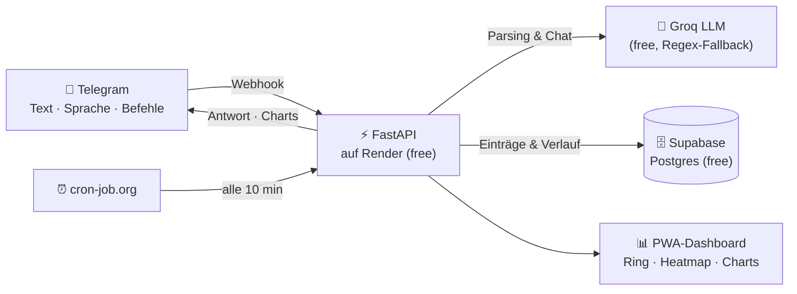

<p align="center">
  
</p>

<p align="center">
  <a href="https://github.com/leonardrieger/trainings-tracker-bot/actions/workflows/test.yml">
    
  </a>
  
  
  <a href="LICENSE">
    
  </a>
</p>

<p align="center">
  <i>Du schreibst deinem Bot „3×8 100 kg Kniebeuge" — den Rest erledigt er.</i>
</p>

Ein persönlicher Fitness-Tracker ohne App-Store, ohne Abo, ohne Formulare:
Trainingseinheiten werden **per Telegram in freier Sprache** geloggt — getippt oder
als **Sprachnachricht** direkt aus dem Gym. Ein installierbares **PWA-Dashboard**
zeigt Fortschritt, Streak und Trainings-Heatmap, und der Bot beantwortet freie
Fragen wie „Was steht heute an?" aus deinem Plan und Verlauf.

Gebaut, um **dauerhaft kostenlos** zu laufen (Supabase Free + Render Free + Groq
Free) und für eine Person gedacht — zum Selbst-Hosten forken und in
[`app/config.py`](app/config.py) den eigenen Trainingsplan eintragen.

## Screenshots

<table>
  <tr>
    <td align="center" width="33%">
      <br>
      <sub><b>Heute</b> — Tagesplan, Activity-Ring &amp; Streak, Schnell-Eingabe</sub>
    </td>
    <td align="center" width="33%">
      <br>
      <sub><b>Fortschritt</b> — Gewichts- und Übungs-Charts mit Zielband</sub>
    </td>
    <td align="center" width="33%">
      <br>
      <sub><b>Verlauf</b> — 6-Monats-Heatmap, Einträge bearbeiten</sub>
    </td>
  </tr>
  <tr>
    <td align="center" width="33%">
      <br>
      <sub><b>Plan</b> — Wochenplan direkt im Dashboard anpassen</sub>
    </td>
    <td align="center" width="33%">
      <br>
      <sub><b>Übungen</b> — Katalog inkl. Aliase &amp; Sektionen verwalten</sub>
    </td>
    <td align="center" width="33%"></td>
  </tr>
</table>

## Features

**Loggen, wie man spricht.** Kraft (`3×8 100 kg Kniebeuge`), Cardio
(`30 min 5 km Laufen`), Körpergewicht (`Gewicht heute 84 kg`) — in beliebiger
Satzstellung, geparst per Groq-LLM mit automatischem Regex-Fallback
(funktioniert auch ganz ohne API-Key). Sprachnachrichten werden per Whisper
transkribiert und laufen durch dieselbe Pipeline.

**Ein Bot, der mitdenkt.** Nicht als Log erkannte Nachrichten beantwortet der
Bot als freie Frage — mit deinem Tagesplan, Wochenstand und Verlauf als Kontext
und Gedächtnis über die letzten Fragen. Bei neuem Bestgewicht meldet er von
sich aus **„🎉 Neuer Rekord!"**.

**Ein Dashboard, das motiviert.** Fünf Tabs im ruhigen Dark-Look: Activity-Ring
mit Streak-Flamme fürs Wochenziel, GitHub-artige Trainings-Heatmap über sechs
Monate, Fortschritts-Charts mit Zielband, Schnell-Eingabe mit Autocomplete und
„Zuletzt"-Chips. Als PWA auf dem Homescreen installierbar.

**Alles im Griff, nichts im Code.** Wochenplan und Übungskatalog (Namen,
Aliase, Tag-Zuordnung) werden direkt im Dashboard gepflegt — kein Deploy nötig.
Einträge lassen sich bearbeiten, löschen, per `/undo` zurücknehmen und als CSV
exportieren.

**Er erinnert dich, bevor du es vergisst.** Morgens der Tagesplan mit
Wochennummer und Deload-Hinweis, sonntags der Wochenrückblick mit Trainingstagen
und Gewichts-Delta — automatisch per Telegram.

## So funktioniert's



**Tech-Stack:** Python 3.12 · FastAPI · Supabase (Postgres) · Groq LLM ·
Matplotlib · Render. Architektur-Details in [`PROJEKT.md`](PROJEKT.md),
Mitmachen: [`CONTRIBUTING.md`](CONTRIBUTING.md).

## Eigene Instanz aufsetzen

Zehn Schritte, ~30 Minuten, alles auf Free-Tiers. Am Ende hast du deinen
eigenen Bot samt Dashboard.

<details>
<summary><b>1 · Telegram-Bot erstellen</b></summary>

1. In Telegram den Chat **@BotFather** öffnen.
2. `/newbot` senden, Namen vergeben.
3. Den erhaltenen **Bot-Token** notieren (Format `123456:ABC-...`).

</details>

<details>
<summary><b>2 · Supabase-Projekt einrichten</b></summary>

1. Auf [supabase.com](https://supabase.com) kostenloses Projekt anlegen.
2. Im SQL-Editor (Dashboard → SQL Editor, **keine CLI nötig**) den Inhalt von
   [`sql/schema.sql`](sql/schema.sql) einfügen und ausführen.
3. Unter **Settings → API**: `Project URL` und **`service_role`**-Key notieren
   (⚠️ nicht den `anon`/`publishable` Key verwenden — der service_role-Key ist
   geheim und umgeht Row-Level-Security, wird aber nur serverseitig in Render
   eingetragen, niemals committet oder öffentlich geteilt).

</details>

<details>
<summary><b>3 · Groq API-Key erstellen (optional, aber empfohlen)</b></summary>

1. Auf [console.groq.com](https://console.groq.com) kostenlos registrieren
   (keine Kreditkarte nötig).
2. Unter **API Keys** einen neuen Key erstellen.
3. Ohne diesen Key funktioniert der Bot trotzdem — er nutzt dann automatisch den
   eingebauten Regex-Parser statt der LLM-Erkennung (Sprachnachrichten brauchen
   den Key allerdings zwingend).

</details>

<details>
<summary><b>4 · Lokal testen (optional, aber empfohlen)</b></summary>

```bash
python -m venv venv
venv\Scripts\activate          # Windows
pip install -r requirements.txt
copy .env.example .env         # dann Werte eintragen
pytest                         # Tests laufen lassen
```

Server lokal starten und Webhook-Request simulieren:

```bash
uvicorn app.main:app --reload
```

```bash
curl -X POST http://127.0.0.1:8000/webhook -H "Content-Type: application/json" -d "{\"message\":{\"chat\":{\"id\":1},\"from\":{\"id\":1},\"text\":\"2 Sätze 8 Wiederholungen 80kg Bankdrücken\"}}"
```

(`ALLOWED_TELEGRAM_USER_ID=1` in `.env` setzen für diesen Testaufruf.)

</details>

<details>
<summary><b>5 · Auf GitHub pushen</b></summary>

```bash
git init
git add .
git commit -m "Trainings-Tracker Bot"
```

Dann Repo auf GitHub erstellen und pushen (siehe GitHub-Anleitung "push an
existing repository").

</details>

<details>
<summary><b>6 · Auf Render deployen</b></summary>

1. Auf [render.com](https://render.com) Account erstellen, mit GitHub verbinden.
2. **New → Web Service** → das gepushte Repo auswählen.
3. Einstellungen:
   - **Build Command:** `pip install -r requirements.txt`
   - **Start Command:** `uvicorn app.main:app --host 0.0.0.0 --port $PORT`
4. Unter **Environment** die Variablen aus `.env.example` eintragen
   (`TELEGRAM_BOT_TOKEN`, `SUPABASE_URL`, `SUPABASE_SERVICE_KEY`, `GROQ_API_KEY`,
   `CRON_SECRET`, `DASHBOARD_TOKEN`, `TELEGRAM_WEBHOOK_SECRET`,
   `ALLOWED_TELEGRAM_USER_ID` — letztere zunächst leer lassen, siehe Schritt 7).
5. Deployen, Render-URL notieren (z.B. `https://dein-bot.onrender.com`).

</details>

<details>
<summary><b>7 · Eigene Telegram-User-ID herausfinden</b></summary>

`/start` an [@userinfobot](https://t.me/userinfobot) schreiben — der zeigt die
eigene ID sofort. ID danach in Render unter `ALLOWED_TELEGRAM_USER_ID` eintragen
und Service neu deployen lassen. (Alternativ zeigt auch der eigene Bot die ID
per `/start`, sobald Webhook und eine vorläufige ID gesetzt sind.)

</details>

<details>
<summary><b>8 · Telegram-Webhook setzen</b></summary>

Einmalig im eigenen Terminal (Token, Render-URL und Webhook-Secret ersetzen —
das `secret_token` sorgt dafür, dass nur echte Telegram-Requests akzeptiert
werden):

```bash
curl "https://api.telegram.org/bot<DEIN_TOKEN>/setWebhook?url=https://dein-bot.onrender.com/webhook&secret_token=<TELEGRAM_WEBHOOK_SECRET>"
```

Antwort sollte `"ok":true` enthalten.

</details>

<details>
<summary><b>9 · Keep-Alive + morgendliche Erinnerung einrichten</b></summary>

Der Endpoint `/cron/tick?token=<CRON_SECRET>` hält den Server wach **und**
verschickt um 7:00 Uhr (Europe/Berlin) die Trainings-Erinnerung — beides in
einem Aufruf, ausgelöst von einem externen kostenlosen Ping-Dienst:

1. Kostenlosen Account bei [cron-job.org](https://cron-job.org) anlegen.
2. Neuen Cronjob anlegen: URL =
   `https://dein-bot.onrender.com/cron/tick?token=<CRON_SECRET>`,
   Intervall = alle 10 Minuten.
3. Fertig — kein weiterer Code nötig.

</details>

<details>
<summary><b>10 · Dashboard aufrufen &amp; installieren</b></summary>

`https://dein-bot.onrender.com/dashboard?token=<DASHBOARD_TOKEN>` im Browser
öffnen. Auf dem Handy über „Zum Home-Bildschirm hinzufügen" installieren —
danach startet es wie eine native App.

</details>

## Nutzung

| Eingabe | Ergebnis |
|---|---|
| `Kniebeuge 4x5 100kg` | Kraft-Eintrag (beliebige Satzstellung) |
| `30 min 5 km Laufen` | Cardio-Eintrag |
| `Gewicht heute 84,2kg` | Körpergewichts-Eintrag |
| 🎤 Sprachnachricht | wird transkribiert und wie Text geloggt |
| „Was steht heute an?" | freie Frage an den Bot, mit Plan &amp; Verlauf als Kontext |
| `/verlauf`, `/chart` | letzte Einträge bzw. Fortschritts-Diagramm (auch für `Gewicht`) |
| `/programm 2026-01-05` | Programmstart setzen, Wochenzähler läuft |
| `/undo` | zuletzt geloggten Eintrag löschen |

## Sicherheit

Alle Geheimnisse (`TELEGRAM_BOT_TOKEN`, `SUPABASE_SERVICE_KEY`, `GROQ_API_KEY`,
`CRON_SECRET`, `DASHBOARD_TOKEN`, `TELEGRAM_WEBHOOK_SECRET`) gehören ausschließlich
in die lokale `.env` (per `.gitignore` ausgeschlossen) und in die
Render-Environment-Variablen — niemals in den Code committen. Webhook, Dashboard
und Cron-Endpoint sind jeweils per Token/Secret geschützt; verarbeitet werden nur
Nachrichten der eigenen Telegram-User-ID.

---

<p align="center">
  <sub>MIT-Lizenz — siehe <a href="LICENSE">LICENSE</a> · für den Eigengebrauch gebaut, zum Forken gedacht 🔥</sub>
</p>
