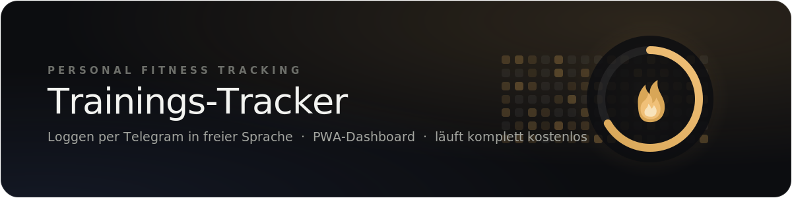
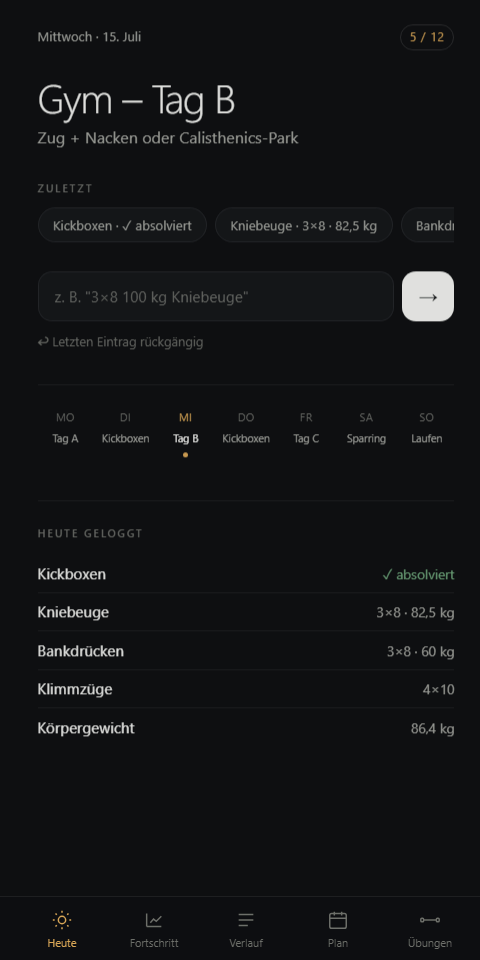
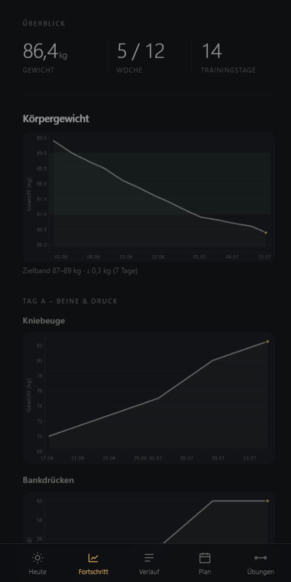
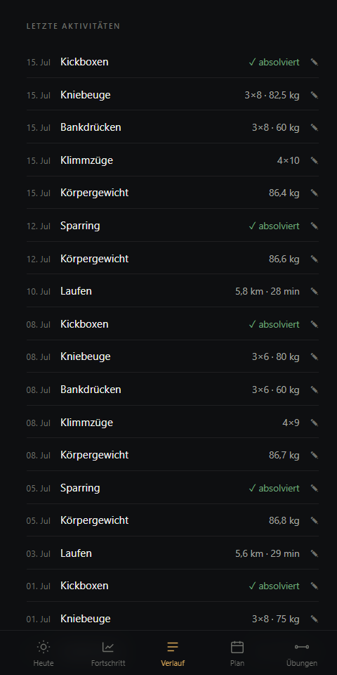
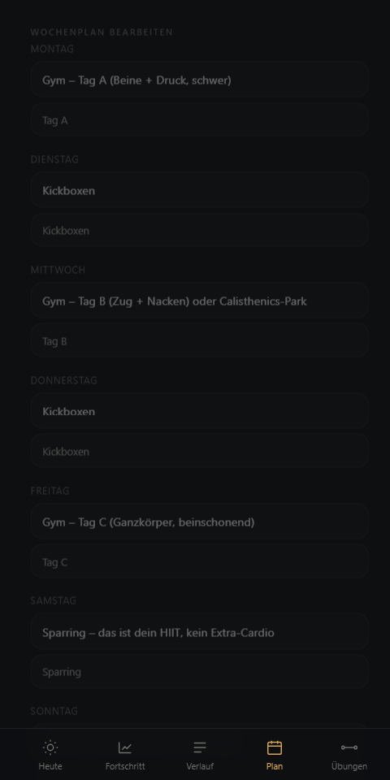
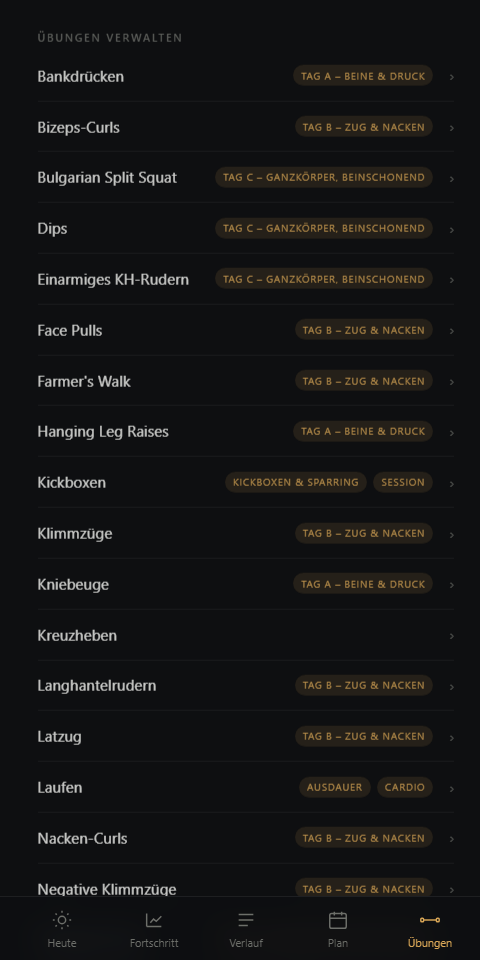

<p align="center">
  
</p>

<p align="center">
  <a href="https://github.com/leonardrieger/trainings-tracker-bot/actions/workflows/test.yml">
    
  </a>
  
  
  <a href="LICENSE">
    
  </a>
</p>

Ein persönlicher Fitness-Tracker, der **komplett per Telegram in freier Sprache**
bedient wird: Du schickst „3×8 100 kg Kniebeuge" oder „Gewicht heute 84,2 kg", und der
Bot legt daraus strukturierte Einträge an. Ein installierbares **Web-Dashboard (PWA)**
zeigt deinen Fortschritt, und du kannst dem Bot ganz normale Fragen stellen wie
„Was steht heute an?".

Gebaut, um **kostenlos** zu laufen (Supabase Free + Render Free + Groq Free) und für
eine Person gedacht — zum Selbst-Hosten forken und in [`app/config.py`](app/config.py)
den eigenen Trainingsplan eintragen.

## Screenshots

<table>
  <tr>
    <td align="center" width="33%">
      <br>
      <sub><b>Heute</b> — Tagesplan, Wochenstreifen, Schnell-Eingabe</sub>
    </td>
    <td align="center" width="33%">
      <br>
      <sub><b>Fortschritt</b> — Gewichts- und Übungs-Charts</sub>
    </td>
    <td align="center" width="33%">
      <br>
      <sub><b>Verlauf</b> — Aktivitäten bearbeiten &amp; löschen</sub>
    </td>
  </tr>
  <tr>
    <td align="center" width="33%">
      <br>
      <sub><b>Plan</b> — Wochenplan direkt im Dashboard anpassen</sub>
    </td>
    <td align="center" width="33%">
      <br>
      <sub><b>Übungen</b> — Katalog inkl. Aliase &amp; Sektionen verwalten</sub>
    </td>
    <td align="center" width="33%"></td>
  </tr>
</table>

## Features

- **Logging in freier Sprache** — Kraft (`3×8 100 kg Kniebeuge`), Cardio
  (`30 min 5 km Laufen`) und Körpergewicht (`Gewicht heute 84 kg`), egal in welcher
  Satzstellung. Groq-LLM-Parsing mit automatischem Regex-Fallback (funktioniert auch
  ganz ohne API-Key).
- **PWA-Dashboard** — app-artige Ansicht (Heute / Fortschritt / Verlauf) mit
  Wochenkalender, Fortschritts-Charts und Schnell-Eingabe; auf dem Handy als App
  installierbar.
- **LLM-Chat über Telegram** — freie Fragen zu Plan und Verlauf; nicht als Log
  erkannte Nachrichten werden automatisch als Frage beantwortet.
- **Automatische Erinnerungen** — morgendlicher Tagesplan + sonntäglicher
  Wochenrückblick, ausgelöst über einen externen Ping-Dienst (hält zugleich den
  Free-Tier-Server wach).
- **Befehle** — `/verlauf`, `/chart`, `/programm`, `/undo`.

## Tech-Stack

Python 3.12 · FastAPI · Supabase (Postgres) · Groq LLM · Matplotlib · Deploy auf Render.
Details zur Architektur in [`PROJEKT.md`](PROJEKT.md).

---

Die folgenden Schritte richten eine eigene Instanz ein.

## 1. Telegram-Bot erstellen

1. In Telegram den Chat **@BotFather** öffnen.
2. `/newbot` senden, Namen vergeben.
3. Den erhaltenen **Bot-Token** notieren (Format `123456:ABC-...`).

## 2. Supabase-Projekt einrichten

1. Auf [supabase.com](https://supabase.com) kostenloses Projekt anlegen.
2. Im SQL-Editor (Dashboard → SQL Editor, **keine CLI nötig**) den Inhalt von
   [`sql/schema.sql`](sql/schema.sql) einfügen und ausführen.
3. Unter **Settings → API**: `Project URL` und **`service_role`**-Key notieren
   (⚠️ nicht den `anon`/`publishable` Key verwenden — der service_role-Key ist geheim
   und umgeht Row-Level-Security, wird aber nur serverseitig in Render eingetragen,
   niemals committet oder öffentlich geteilt).

## 3. Groq API-Key erstellen (optional, aber empfohlen)

1. Auf [console.groq.com](https://console.groq.com) kostenlos registrieren (keine
   Kreditkarte nötig).
2. Unter **API Keys** einen neuen Key erstellen.
3. Ohne diesen Key funktioniert der Bot trotzdem — er nutzt dann automatisch den
   eingebauten Regex-Parser statt der LLM-Erkennung.

## 4. Lokal testen (optional, aber empfohlen)

```bash
python -m venv venv
venv\Scripts\activate          # Windows
pip install -r requirements.txt
copy .env.example .env         # dann Werte eintragen
pytest                         # Parser-Tests laufen lassen
```

Server lokal starten und Webhook-Request simulieren:

```bash
uvicorn app.main:app --reload
```

```bash
curl -X POST http://127.0.0.1:8000/webhook -H "Content-Type: application/json" -d "{\"message\":{\"chat\":{\"id\":1},\"from\":{\"id\":1},\"text\":\"2 Sätze 8 Wiederholungen 80kg Bankdrücken\"}}"
```

(`ALLOWED_TELEGRAM_USER_ID=1` in `.env` setzen für diesen Testaufruf.)

## 5. Auf GitHub pushen

```bash
git init
git add .
git commit -m "Trainings-Tracker Bot"
```

Dann Repo auf GitHub erstellen und pushen (siehe GitHub-Anleitung "push an existing
repository").

## 6. Auf Render deployen

1. Auf [render.com](https://render.com) Account erstellen, mit GitHub verbinden.
2. **New → Web Service** → das gepushte Repo auswählen.
3. Einstellungen:
   - **Build Command:** `pip install -r requirements.txt`
   - **Start Command:** `uvicorn app.main:app --host 0.0.0.0 --port $PORT`
4. Unter **Environment** die Variablen aus `.env.example` eintragen
   (`TELEGRAM_BOT_TOKEN`, `SUPABASE_URL`, `SUPABASE_SERVICE_KEY`, `GROQ_API_KEY`,
   `CRON_SECRET`, `DASHBOARD_TOKEN`, `TELEGRAM_WEBHOOK_SECRET`,
   `ALLOWED_TELEGRAM_USER_ID` — letztere zunächst leer lassen, siehe Schritt 7).
5. Deployen, Render-URL notieren (z.B. `https://dein-bot.onrender.com`).

## 7. Eigene Telegram-User-ID herausfinden

Dem Bot in Telegram `/start` schreiben (funktioniert erst nachdem `ALLOWED_TELEGRAM_USER_ID`
vorläufig auf irgendeinen Wert gesetzt und der Webhook (Schritt 8) gesetzt ist — oder
einfacher: `/start` an [@userinfobot](https://t.me/userinfobot) schreiben, der zeigt die
eigene ID sofort). ID danach in Render unter `ALLOWED_TELEGRAM_USER_ID` eintragen und
Service neu deployen lassen.

## 8. Telegram-Webhook setzen

Einmalig im eigenen Terminal (Token, Render-URL und Webhook-Secret ersetzen —
das `secret_token` sorgt dafür, dass nur echte Telegram-Requests akzeptiert werden):

```bash
curl "https://api.telegram.org/bot<DEIN_TOKEN>/setWebhook?url=https://dein-bot.onrender.com/webhook&secret_token=<TELEGRAM_WEBHOOK_SECRET>"
```

Antwort sollte `"ok":true` enthalten.

## 9. Keep-Alive + morgendliche Erinnerung einrichten

Der Endpoint `/cron/tick?token=<CRON_SECRET>` hält den Server wach **und** verschickt um
7:00 Uhr (Europe/Berlin) die Trainings-Erinnerung für den Tag — beides in einem Aufruf,
ausgelöst von einem externen kostenlosen Ping-Dienst (kein GitHub-Actions-Cron, da das bei
einem privaten Repo das kostenlose Minutenkontingent sprengen würde):

1. Kostenlosen Account bei [cron-job.org](https://cron-job.org) anlegen.
2. Neuen Cronjob anlegen: URL = `https://dein-bot.onrender.com/cron/tick?token=<CRON_SECRET>`,
   Intervall = alle 10 Minuten.
3. Fertig — kein weiterer Code nötig.

## 10. Dashboard aufrufen

`https://dein-bot.onrender.com/dashboard?token=<DASHBOARD_TOKEN>` im Browser öffnen und als
Lesezeichen speichern. Zeigt Körpergewichts-Trend, eine Karte pro geloggter Übung mit
Verlaufs-Chart, sowie die letzten 20 Aktivitäten.

## Nutzung

- Beliebige Nachricht mit Übung + Zahlen senden, z.B. `Kniebeuge 4x5 100kg`.
- Körpergewicht: `Gewicht heute 84,2kg`.
- Cardio: `30 min 5 km Laufen`.
- `/verlauf Kniebeuge` (oder `/verlauf Gewicht`) — letzte Einträge als Text.
- `/chart Kniebeuge` (oder `/chart Gewicht`) — Liniendiagramm als Bild.
- `/undo` — löscht den zuletzt geloggten Eintrag (bei Vertipper oder Fehlerkennung).
- Dashboard: siehe Schritt 10.

## Sicherheit

Alle Geheimnisse (`TELEGRAM_BOT_TOKEN`, `SUPABASE_SERVICE_KEY`, `GROQ_API_KEY`,
`CRON_SECRET`, `DASHBOARD_TOKEN`, `TELEGRAM_WEBHOOK_SECRET`) gehören ausschließlich in
die lokale `.env` (per `.gitignore` ausgeschlossen) und in die Render-Environment-Variablen
— niemals in den Code committen. Webhook, Dashboard und Cron-Endpoint sind jeweils per
Token/Secret geschützt.

## Lizenz

MIT — siehe [`LICENSE`](LICENSE).
